# 04 · 架构图（Architecture）

> 本文所有图均以 Mermaid 源码给出（可在 GitHub 直接渲染），同时已用 `@mermaid-js/mermaid-cli` v11 + headless Chrome 预渲染为 PNG，位于 [`diagrams/`](diagrams/)（`.mmd` 源 + `.png`）。
> 图中术语与 [03-technical-design.md](03-technical-design.md) 一致：Review Unit（审查单元）、Rule-as-Question、Pass 1 / Pass 2、band（report / uncertain / drop）、verdict。

## 0. 一句话架构

**确定性管线负责“看哪里、问什么、怎么说”，Jev 只负责“是不是、有多严重、在哪一行”的判断。** 所有输出文本均来自规则目录的模板（或可选的 LLM 叙述器，且其输出须再经 Jev 校验）。

| 层 | 职责 | 是否调用 Jev |
|---|---|---|
| Intake（git / select / lang） | 取 diff、过滤文件、识别语言 | 否 |
| Plugin & Rules | 加载语言插件与规则包、跑触发器、编译问题 | 否 |
| Units & Security | 切审查单元、拼上下文、脱敏、注入探针 | 否 |
| Judge | Pass 1 筛查、Pass 2 定位、阈值分档、判决 | **是**（唯一出口：`JevProvider`） |
| Narrate（P2，可选） | LLM 写解释/修复建议 → Jev 校验 | LLM + Jev |
| Render / Report / GitHub | 模板渲染、多格式输出、PR 评论 | 否 |

---

## 1. 系统上下文（System Context）

三种入口（开发者终端、宿主编码 Agent 的 skill/命令、CI）共用同一个 CLI。外部依赖只有：本地 Git、TypeSafe Jev API（必需，除 mock/replay 模式）、可选 LLM、GitHub API / Code Scanning（仅 CI 场景）。

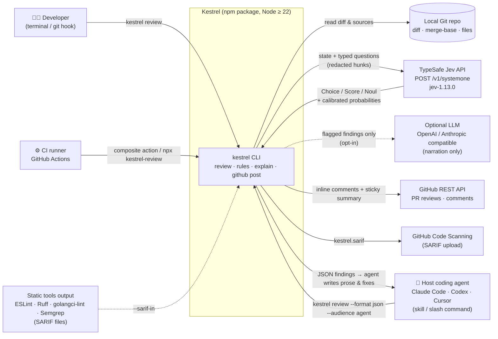

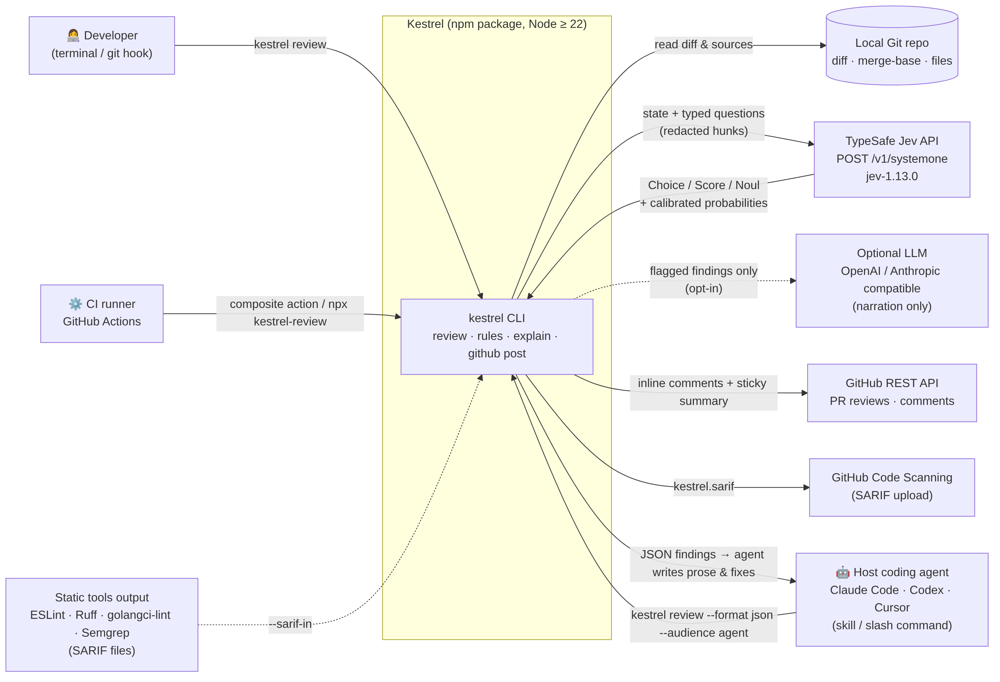

要点：

- **Agent 场景下“写字的是宿主 Agent”**：`--format json --audience agent` 输出结构化发现（规则 id、行号、概率、模板消息、修复提示），由 Claude Code / Codex / Cursor 自身组织语言与修改代码——这恰好弥补 Jev 不生成文本的限制，而无需 Kestrel 自带 LLM。
- 发送给 Jev 的只有**脱敏后的 hunk 窗口 + 有限上下文**，不是整个仓库。
- LLM 虚线表示可选且默认关闭。

---

## 2. 组件图（Components）

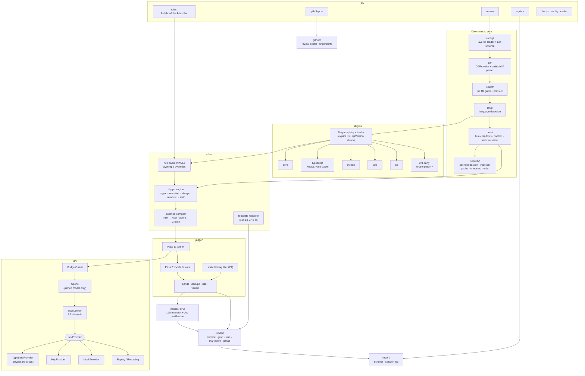

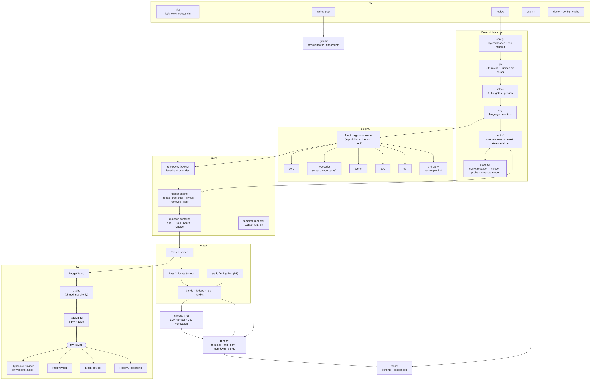

模块依赖约束（实现时用 lint 规则或目录边界守护）：

1. `jev/` 不依赖任何业务模块；`judge/` 是唯一调用 `JevProvider` 的模块（`narrate/` 通过 `judge/` 暴露的校验函数间接调用）。
2. `plugins/` 只“声明”（语言、规则包、上下文/事实提供者），不做 I/O 以外的副作用；第三方插件仅从配置显式列出的包加载。
3. `render/` 是纯函数：`(Report, options) → string | object`，便于快照测试。
4. `rules/` 的问题编译器是纯函数：`(unit, rules) → JevRequest`，便于用固定 cassette 回放测试。

---

## 3. 审查管线时序（Review Pipeline Sequence）

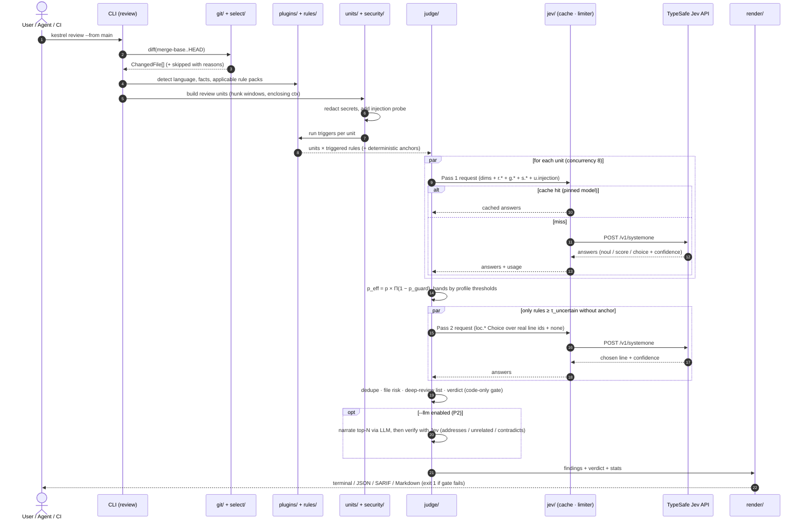

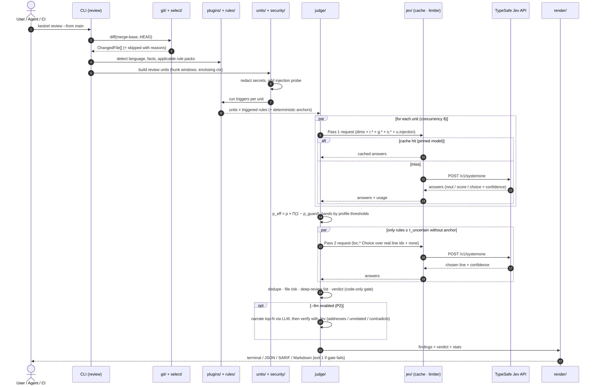

阶段与 03 文档 S0–S11 的对应：①–② = S0–S2（配置、diff、过滤）；③ = S3（语言/插件分派）；④–⑥ = S4–S5（单元、上下文、安全）；⑦–⑧ = S6（触发）；⑨–⑬ = S7（Pass 1）；⑭ = S8（分档）；⑮–⑱ = S9（Pass 2）；⑲ = S10（去重、风险、判决）；⑳ = P2 叙述；㉑–㉒ = S11（渲染/输出）。

延迟预算（典型 PR：约 40 个单元，并发 8）：Pass 1 约 5 轮 × 70–500 ms ≈ 0.4–2.5 s，Pass 2 仅对少量无锚点规则，目标 **p50 < 3 s、成本 < $0.01**（不含 LLM；与 03 §14 一致，需实测验证）。

---

## 4. 插件模型（Class Diagram）

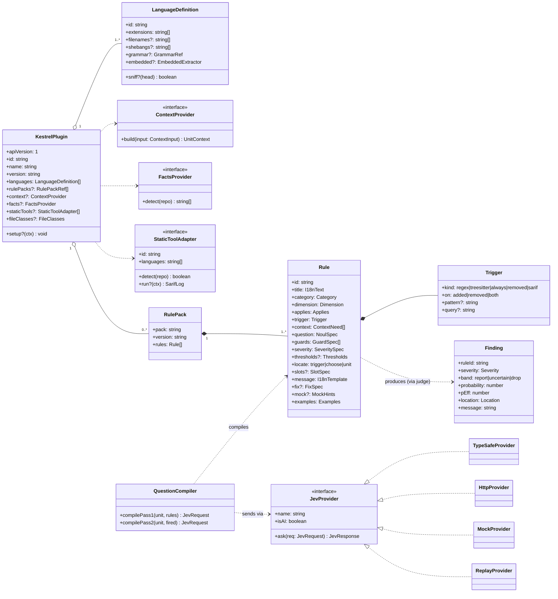


说明：

- **一个语言 = 一个插件**（`KestrelPlugin`），可以声明多个 `LanguageDefinition`（如 typescript 插件同时声明 `typescript`、`tsx`、`javascript`（`.jsx` 归入 javascript），Vue SFC 通过 `embedded` 提取 `<script>` 块）。
- **规则是数据，不是代码**：`Rule` 由 YAML 描述，`QuestionCompiler` 把 `question`/`guards`/`severity` 编译成 Jev 的 Noul/Score/Choice；插件作者无需写 TS 就能扩展规则。
- `ContextProvider`/`FactsProvider`/`StaticToolAdapter` 是可选的代码扩展点（MVP 仅用启发式上下文；P1 起 tree-sitter）。
- `JevProvider` 四种实现使得测试与离线 CI 完全不依赖 Jev key。

---

## 5. 置信度分档与判决流程（Decision Flow）

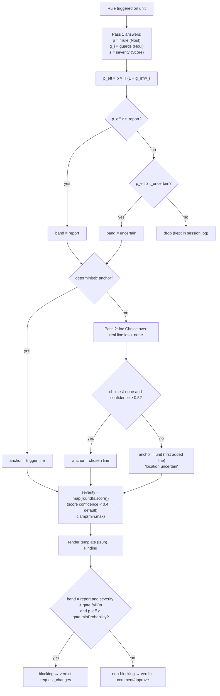

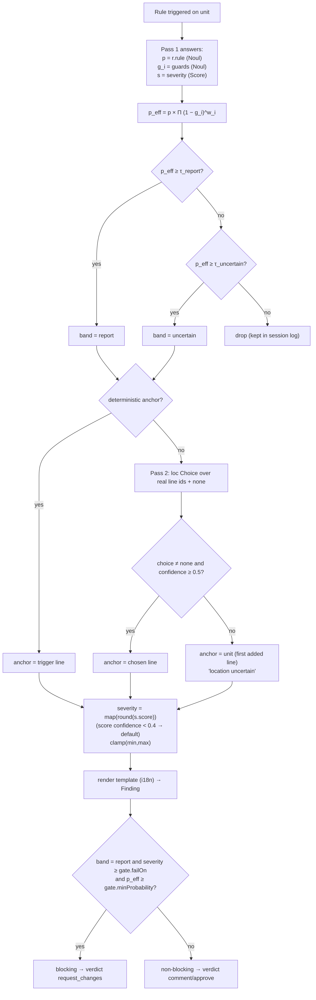

- 阈值 `τ_report / τ_uncertain` 按 profile：chill 0.85/0.70、balanced 0.75/0.55、assertive 0.60/0.40（**初始值，需 P3 用标注集校准**）。
- `p_eff` 的乘法护栏公式是**启发式**，并非 Jev 官方语义；Noul 只返回“是”的概率（无 confidence 字段），分档直接基于该概率；`confidence` 仅用于 Choice（定位）与 Score（严重度）的可信度判断。
- 门禁只看 `band=report` 且严重度 ≥ `gate.failOn`（默认 high）且 `p_eff ≥ gate.minProbability`（默认 0.8）的发现；`uncertain` 永远不阻塞合并。

---

## 6. CI 集成流程（GitHub Action）

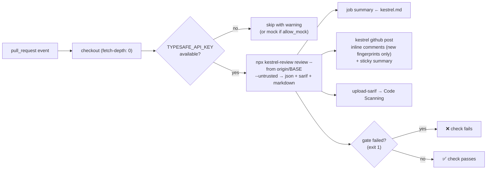

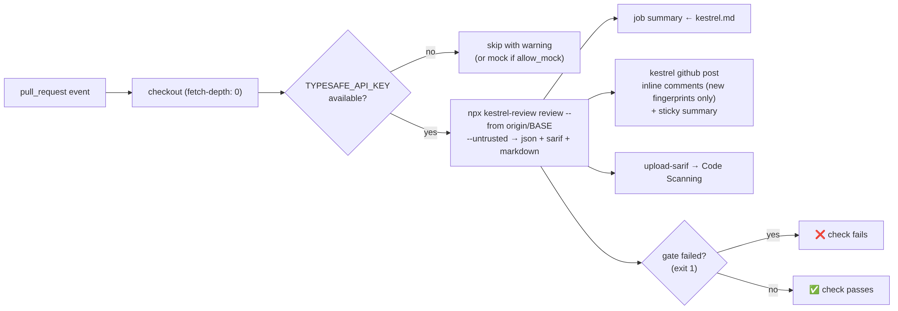

- fork PR 拿不到 secret 时默认**跳过并警告**，不静默降级到 mock（mock 结果无审查意义；`CI=true` 时未显式允许 mock 则退出码 3）。
- `--untrusted`（Action 默认开启）：不加载第三方代码插件、不运行静态工具，只允许内置插件与纯数据 YAML 规则包（见 03 §5.4 / §11）。

---

## 7. 部署形态

| 形态 | 载体 | 调用方式 |
|---|---|---|
| CLI | npm 包 `kestrel-review`（bin `kestrel` → `bin/kestrel.mjs`） | `npx kestrel-review review` / 全局安装 |
| Skill | `skills/kestrel/SKILL.md`（兼容 `npx skills add lpliu-art/kestrel`） | 宿主 Agent 读取 SKILL.md 后调用 CLI |
| 插件/命令 | `plugins/kestrel/claude-code/commands/review.md`、`.claude-plugin/marketplace.json`；Codex/Cursor 清单（P2，格式待按官方规范核实） | `/kestrel:review` |
| CI | 仓库根 `action.yml`（composite） | `uses: lpliu-art/kestrel@v1` |
| 单二进制（0.4.1） | Node SEA。语法 wasm 打进资源；`doctor` 显示 `parser: tree-sitter` 或 `parser: regex-fallback` | 无 Node 环境时使用。规则 YAML 在二进制旁的 `payload/` |

## 8. 渲染说明

PNG 由以下命令生成（可复现）：

```bash
npm i @mermaid-js/mermaid-cli@11
echo '{"executablePath":"/usr/bin/google-chrome","args":["--no-sandbox","--disable-gpu"]}' > pp.json
for f in diagrams/*.mmd; do npx mmdc -p pp.json -i "$f" -o "${f%.mmd}.png" -w 1800 -b white -s 2; done
```
